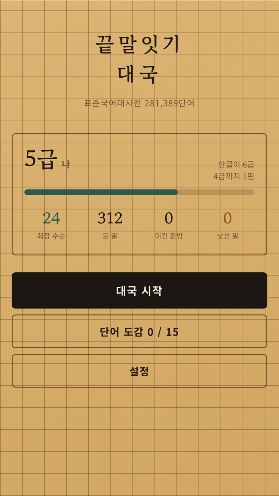
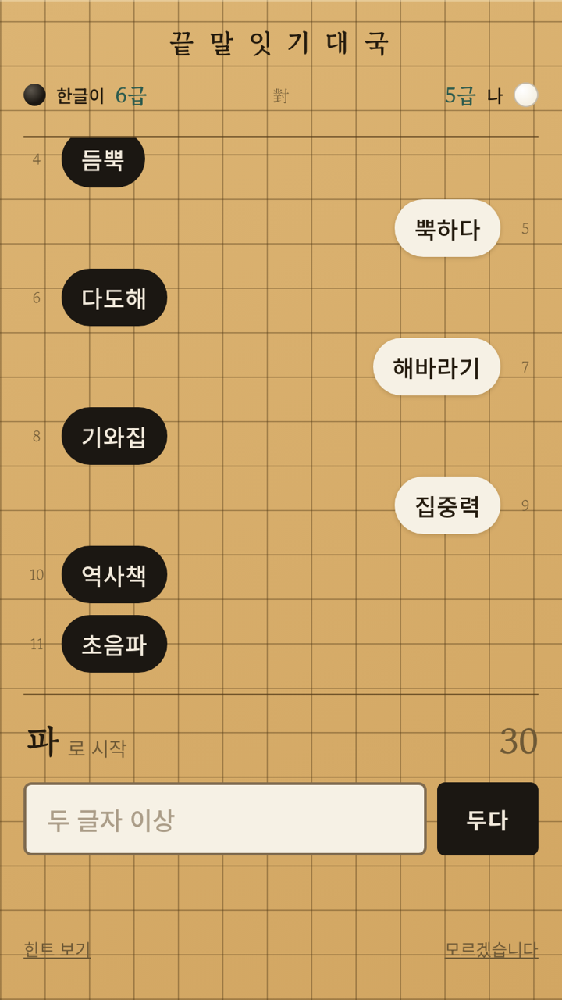
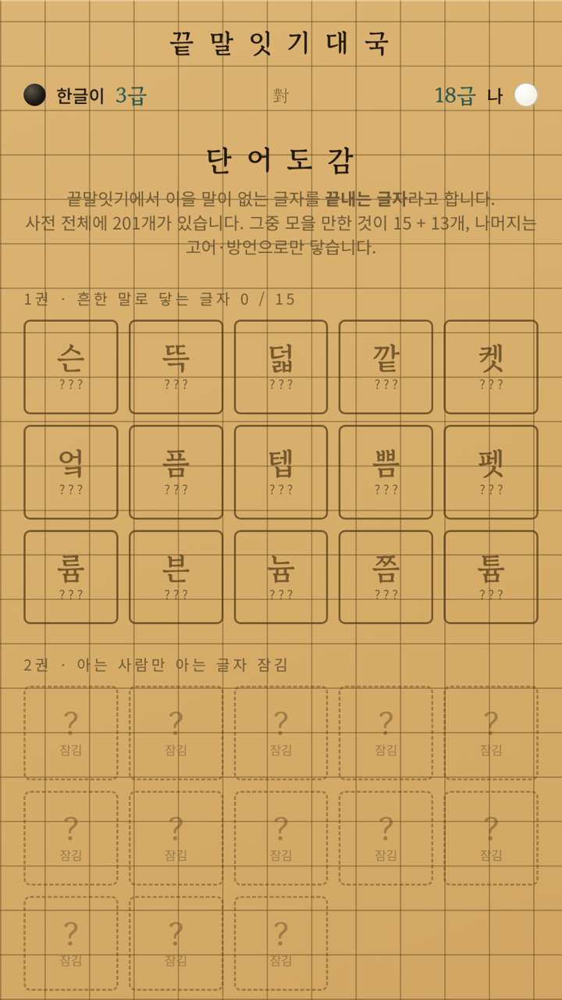
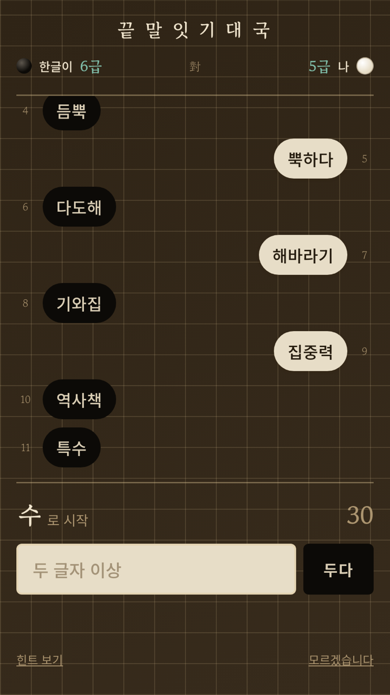

# 끝말잇기 대국

바둑의 형식을 빌린 한국어 끝말잇기. **서버 없이 완전 오프라인으로 도는 웹 게임**이고,
같은 코드 하나가 웹(PWA) · 안드로이드(TWA) · 토스 미니앱 세 군데로 나간다.

| | |
|---|---|
| 웹에서 바로 | https://wordbaduk-production.up.railway.app |
| 원스토어 | https://m.onestore.co.kr/v2/ko-kr/app/0001009462 |
| 앱인토스 | 심사 중 |

<p>
  
  
  
  
</p>

---

## 핵심은 하나 — 져줄 줄 아는 AI

Play 스토어에 한국어 끝말잇기 앱이 28개 넘게 있는데 평점이 **2.8~3.9**다.
같은 시장의 다른 단어게임은 4.6~4.9인데도.

불만의 정체는 앱 목록에 그대로 드러나 있다. 「끝말잇기 한방단어」「끝말잇기 고수사전」처럼
*공략집 앱*이 따로 장사가 될 만큼 있다. AI가 한방단어로 찍어눌러서 사람들이 진다.

> 사람들은 이기고 싶은 게 아니라 **아슬아슬하게 이기고 싶어한다.**

그래서 이 프로젝트에서 가장 공들인 건 사전도 UI도 아니고 **패배의 설계**다.

---

## 무엇이 들어 있나

```
app/
  index.html
  src/main.js            진입점 — 사전과 저장값을 받아 게임을 켠다
  src/game.js            게임 로직 (854줄)
  src/platform.js        토스 SDK 어댑터 — 없으면 브라우저 폴백
  src/style.css
  public/dict.json       사전 2.4MB (빌드 산출물이지만 커밋한다)
  public/sw.js           서비스 워커
  public/.well-known/assetlinks.json
  server.js              정적 서버 (Node 표준 모듈만, 69줄)
  apps-in-toss.config.ts
  railway.json
tools/build_dict.py      사전 빌드 파이프라인 (195줄)
docs/why-wordchain.md    왜 이 아이템인가
docs/maker-note.md       설계 노트 (난이도 상수와 실측치)
store/
  screens/               실제 앱 화면 (위 스크린샷)
  one/                   원스토어 등록 자산과 등록 문구
  one/upload/            원스토어 업로드가 통과한 경량본 (아래 참조)
index.html               단일 파일 프로토타입 (보존용)
```

전체 **1,569줄**. 런타임 의존성은 `@apps-in-toss/web-framework` **1개**,
개발 의존성은 `vite` **1개**다.

---

## 실행

```bash
cd app
npm install
npm run dev          # http://localhost:5173
npm run build        # dist/
npm start            # node server.js
```

토스 미니앱으로 빌드·배포할 때:

```bash
npx ait build        # dist/ → wordbaduk.ait (1.0MB)
npx ait token add    # 콘솔 API 키 등록 (최초 1회)
npx ait deploy
```

> CLI는 **3.x**라 설정 파일이 `apps-in-toss.config.ts`다.
> 문서에 자주 보이는 `granite.config.ts`는 2.x 형식이다. 2.x 프로젝트는 `ait migrate`로 변환한다.

사전을 다시 만들 때:

```bash
python3 tools/build_dict.py --dry-run   # 통계만 출력
python3 tools/build_dict.py             # 주입까지
```

---

## 설계

### 난이도는 어휘가 아니라 행동을 조절한다

처음엔 난이도로 AI의 어휘를 잘랐다. 결과는 `박스 → 스포츠` **2수 만에 종료**였다.
「스포츠」는 사전에 이을 말이 없는 한방단어다.
어휘 구멍으로 지는 건 실력이 아니라 사고다. 플레이어는 이겼는데 기분이 나쁘다.

지금 AI는 **늘 24,912개를 다 본다.** 난이도가 정하는 건 두 가지뿐이다 —
어느 단의 말을 고를지, 그리고 말이 안 떠오를 확률.

### 막히는 건 빡빡한 자리에서만

```js
function blankChance(n){            // n = 그 자리에 남은 선택지 수
  if (st.exam) return 0;                    // 승급 시험에서는 봐주지 않는다
  if (st.difficulty >= 0.7) return 0;
  var ease   = Math.max(0, 0.7 - st.difficulty) / 0.6;
  var scarce = n <= 4 ? 1 : n <= 12 ? 0.8 : n <= 30 ? 0.4 : n <= 60 ? 0.06 : 0;
  return 0.6 * ease * scarce;
}
```

`scarce`가 이 함수의 전부다. 실제 국면의 **62.8%는 둘 수 있는 말이 61개를 넘는다.**
「가」처럼 수백 개가 있는 자리에서 AI가 "모르겠습니다"를 하면 봐준 게 즉시 들통난다.
그래서 61개 초과는 `×0`으로 막았다. 고친 뒤 실측하면 **막힌 사건의 92%가 선택지 30개 이하**에서 일어난다.

### 질 때는 고민한다

이길 때든 질 때든 620ms로 똑같이 두면 **못 두는 순간만 도드라진다.**
초기 버전은 뜸들이기와 결과가 붙어 있어서 `P(항복 | 고민함) = 43%`였다. 두세 판이면 눈치챈다.

계획과 타이밍을 분리했다. 무엇을 둘지 먼저 정하고, 얼마나 뜸들일지는 따로 정한다.
선택지가 적을수록, 지고 있을수록 평소에도 더 오래 생각한다.
지금은 난이도별 **30% / 24% / 10%** — **오래 생각하고도 그냥 두는 경우가 더 많다.**

### 한방 자리를 얼마나 열어줄지도 난이도다

끝말잇기는 「스포츠」처럼 이을 말이 없는 **한방단어** 하나로 끝난다.
그래서 "AI가 어떤 말로 끝내느냐"가 곧 "내가 한방을 쓸 수 있느냐"다.

측정해보니 AI 어휘의 **18.4%가 한방 자리를 연다.** 그냥 두면 한 수 걸러 한 번꼴이고,
**흔한 한방단어 몇 개만 외우면 급수와 상관없이 이긴다.**

그래서 수를 고르기 **전에** 이번 수에 열어줄지를 먼저 정한다.

```js
function offerChance(){
  if (st.moves.length < 12) return 0;        // 초반에는 한 자리도 열지 않는다
  return 0.04 + 0.13 * Math.pow(1 - level(), 1.5);
}
```

18급 15% → 10급 11% → 1급 7% → 3단 5%. 승급 시험에서는 4%까지 조인다.
**바닥을 4%로 남긴 이유**가 있다 — 완전히 막으면 도감의 '끝내는 글자'를 모을 길이 끊긴다.

위험도는 사전 전체가 아니라 **AI가 아는 흔한 말**로만 센다.
고어·방언으로만 닿는 한방은 아무도 못 쓰므로 위험이 아니다.

### 급수가 AI의 바닥을 정한다

난이도가 승패만 따라 움직이면 승률이 59%에 수렴해서 오래 한 사람은 누구나 3단이 된다.
그런 급수는 자랑이 안 된다.

```js
function rankFloor(){
  return 0.10 + 0.72 * Math.pow(st.rankIdx / (RANKS.length - 1), 1.6);
}
```

승급할 때마다 AI가 내려갈 수 있는 바닥이 같이 오른다 — 18급 0.10 / 10급 0.31 / 1급 0.65 / 3단 0.82.
지수 `1.6` 때문에 초반은 완만하고 위로 갈수록 가파르다.
**어딘가에서 반드시 막히고, 막히는 자리가 곧 실력이다.**

급수는 14단계(18급~3단). 3승마다 승급 시험을 치르고, 시험에서는 봐주지 않는다.
승리 `+0.09` / 패배 `-0.13` — 푸는 쪽이 빠른 건 연패가 이탈로 직결되기 때문이다.

### 끝내는 글자 도감

사전 281,389개를 전부 훑어 **뒤에 이을 말이 없는 글자 201개**를 계산했다.
그중 실제 대국에서 닿을 수 있는 28자를 도감 두 권(15 + 13)으로 나눴다.

1권은 흔한 말로 닿고(무슨·잔뜩·바깥·부엌·슬픔), 2권은 명사로는 닿지만 흔하지 않은 것들이다
(살갗·헝겊·펭귄·뒤꼍·남녘·그믐·수탉·히읗). 나머지 173자는 고어·방언으로만 닿아서 뺐다 —
**못 채우는 칸은 도감이 아니라 벽이다.**

"콘텐츠를 더 만들어야 하는" 수집 요소가 아니라 **사전에서 유도되는** 수집 요소다.

### 비대칭

AI는 흔한 명사만 안다. 사람은 사전 전체를 쓴다.
「담론」「성찰」처럼 AI가 모르는 말을 두면 금색 돌로 놓이고 도감의 *낯선 말*에 쌓인다.
그 말로 길이 끊기면 그대로 이긴다. 일상어 기준 낯선 말이 뜨는 비율은 2%라 특별함이 유지된다.

### 소리 — 음원 파일 0개

토스 게임 심사 항목이 요구한다: 효과음·햅틱이 있을 것, 사용자가 끌 수 있을 것,
백그라운드로 가면 즉시 멈출 것.

**WebAudio로 전부 합성했다.** 바둑돌은 잡음 버스트 + 공명음, 종과 징은
비조화 배음(inharmonic partials)을 겹쳐 만든다. 오디오 파일이 0개라 번들이 안 커진다.
`visibilitychange`에서 `AudioContext.suspend()`를 건다.

---

## 사전

`tools/build_dict.py`가 원천 3종을 조합해 만든다. 손으로 만든 사전은 아무도 검증할 수 없다.

| 원천 | 쓰임 |
|---|---|
| 표준국어대사전 계열 표제어 366,505 | 사용자가 쓸 수 있는 말 |
| 자막 말뭉치 빈도 상위 5만 | "흔한 말"을 가리는 기준 |
| 명사 사전 | 빈도 목록에 섞인 `내가` `거야` `그래` 제거 |

| | 크기 |
|---|---|
| 사용자가 쓸 수 있는 말 | **281,389** (2~4음절) |
| AI가 아는 말 | **24,912** (빈도순 3단: 2,469 / 2,107 / 20,336) |
| 응수율 | **94.6%** |
| 끝내는 글자 | **201자** (도감 28자) |

**두음법칙**을 구현했다. `락원` 다음에 `낙`으로도 `악`으로도 이을 수 있다.
중성이 ㅑㅒㅕㅖㅛㅠㅣ일 때 ㄹ→ㅇ, 아니면 ㄹ→ㄴ. 실제 끝말잇기의 수싸움이 여기서 난다.

산출물은 `dict.json` 2.4MB. 번들에 인라인하지 않고 `public/` 자산으로 두고 런타임에 `fetch` 한다.
빌드 산출물이지만 **커밋한다** — 배포처가 저장소만 받아서 빌드할 수 있어야 하기 때문이다.

---

## 한 코드로 세 플랫폼

`platform.js` 75줄이 토스 SDK와 브라우저 폴백을 흡수한다.

```js
export const storage = {
  async get(key) {
    try {
      if (sdk?.Storage) return await sdk.Storage.getItem({ name: key });
      return localStorage.getItem(key);       // 브라우저 폴백
    } catch { return null; }
  },
};
```

토스 Storage는 비동기이고 localStorage는 동기다. **인터페이스를 async로 통일**해서
호출부가 분기를 모르게 했다. 덕분에 미니앱 코드를 일반 브라우저에서 그대로 열어 개발한다.

### 왜 WebView인가

Granite은 WebView SDK와 React Native SDK 두 갈래인데 WebView를 골랐다.
턴제 텍스트 UI라 네이티브 성능이 필요 없고, 다듬어둔 DOM/CSS를 그대로 쓸 수 있다.
RN으로 가면 화면을 전부 다시 그려야 하는데 그만한 이득이 없다.

### 왜 프레임워크가 없나

전체 JS 번들이 **24.45KB(gzip 9.82KB)** 다. React 런타임만 그보다 크다.
화면이 넷(홈/대국/도감/설정)이고 DOM 갱신은 기보에 한 줄 추가하는 게 대부분이라
가상 DOM이 풀 문제가 없었다.

다만 팀 프로젝트였다면 다르게 골랐을 것이다. `game.js` 854줄이 한 파일에 몰려 있는 건
혼자 쓰고 혼자 읽기 때문에 감당되는 구조다.

### 백엔드가 없는 이유

원래 Railway에 백엔드를 올릴 계획이었는데, 토스 게임센터 문서를 읽고 없앴다.
**리더보드의 UI와 데이터를 토스가 전부 관리한다.** `Game.setLeaderboardScore`로
최장 수순을 올리는 게 전부다.

부수 효과로 **개인정보 수집이 0**이 됐다. 처리방침이 정직해지고, 원스토어의
"앱에서 수집되는 데이터가 없습니다" 배지가 그냥 사실이 된다.

서버가 필요해지는 건 토스가 안 해주는 것들이다 — 도감 전국 달성률, 기록 어뷰징 방어,
원격 설정. 지금은 없어도 되고, 필요해지면 그때 올린다.

---

## 배포

```
git push ──▶ Railway (NIXPACKS)
             npm run build  →  node server.js
                                   │
             ┌─────────────────────┼─────────────────────┐
             ▼                     ▼                     ▼
          웹 (PWA)          안드로이드 (TWA)         토스 미니앱
                          구글 플레이 / 원스토어
```

`server.js`는 Node 기본 모듈만 쓰는 얇은 정적 서버다. 의도적인 결정이 들어 있다.

```js
function cacheFor(path) {
  if (path.endsWith('sw.js')) return 'no-cache';            // 새 버전이 영영 안 내려감
  if (path.includes('/assets/')) return 'public, max-age=31536000, immutable';
  if (path.endsWith('dict.json')) return 'public, max-age=86400';
  return 'public, max-age=300';
}
```

- `.webmanifest`를 `application/manifest+json`으로 내려준다
- `Service-Worker-Allowed: /` 가 있어야 루트 스코프 등록이 된다
- **확장자가 있는 요청은 정직하게 404** — SPA 폴백이 `.json`까지 삼키면
  `assetlinks.json` 자리에 HTML이 가서 TWA 검증이 조용히 실패한다

---

## 막혔던 곳

이 저장소에서 읽을 가치가 가장 큰 부분이다.

### 서비스 워커가 업데이트 경로를 막고 있었다

증상이 없어서 더 위험했다. SW가 `index.html`까지 캐시 우선으로 서빙하고 있었는데,
TWA는 껍데기만 스토어에 올라가고 **내용은 매번 웹에서 받아오는** 구조다.
문서가 캐시에 고정되면 한 번 설치한 기기는 새 빌드를 영영 못 받는다.
출시 후 업데이트 경로가 통째로 막히는 문제였다.

전략을 둘로 나눴다 — **문서는 네트워크 우선**(실패 시 캐시), 나머지는 캐시 우선.
해시가 박힌 자산은 내용이 바뀌면 이름이 바뀌므로 캐시 우선이 안전하다.

> 오프라인 지원과 업데이트 가능성은 상충한다. 문서와 해시 자산은 캐시 전략이 달라야 한다.

### TWA 주소창이 사라지지 않았다

앱 상단에 `railway.app` 주소창이 남아 있었다.
원인은 **스토어가 업로드한 AAB를 자기 키로 다시 서명**하기 때문이다.
기기에 설치된 앱의 지문은 내가 서명한 지문이 아니다.

`assetlinks.json`에 지문이 **3개** 들어 있는 이유다.

```
A1:04:E5:6F:AC…   PWABuilder 업로드 키
B5:86:1D:90:13…   구글 플레이 앱 서명 키
AB:F5:6B:9E:D2…   원스토어 앱 서명 키
```

반영 확인:

```bash
curl -s "https://digitalassetlinks.googleapis.com/v1/statements:list\
?source.web.site=https://wordbaduk-production.up.railway.app\
&relation=delegate_permission/common.handle_all_urls"
```

구글이 캐시를 들고 있어서 배포 후 몇 분 걸린다. 기기에 설치된 앱도 검증 결과를 캐시하므로
**지우고 재설치**해야 한다. 실패가 조용해서, 검증 API를 아는 것 자체가 해결 수단이다.

### `re.sub` 치환문이 역슬래시를 해석했다

빌드한 사전 JSON이 깨졌다. 파이썬 `re.sub`의 **치환 문자열은 이스케이프를 해석**해서,
사전 데이터의 `\n`이 실제 개행으로 치환됐다.

```python
# re.sub 치환문은 역슬래시를 해석하므로 lambda로 넘긴다
html = re.sub(pattern, lambda m, v=value, n=name: f"var {n} = {v};\n", html, count=1, flags=re.S)
```

### 출시본에 개발용 잔재가 남아 있었다

설정에 광고 토글이 있었고, 켜면 "리워드 광고 자리" 같은 **자리표시자 화면**이 떴다.
첫 화면에는 설계 노트가 노출돼 있었고 그 안에 난이도 상수와 실측 승률이 전부 적혀 있었다.

`ADS_DEFAULT`가 false면 토글 자체를 렌더링하지 않게 하고, **예전 저장값이 켜져 있어도 무시**하도록 했다.
토글을 숨기기만 하면 한 번 켜본 기기는 되돌릴 방법이 없기 때문이다.
설계 노트는 `docs/maker-note.md`로 옮겼다.

> 개발 중 편의 기능은 출시 플래그와 함께 사라져야 한다. 상태 복원은 기능 제거와 짝을 이뤄 점검해야 한다.

### 레이아웃 3연타

| 증상 | 원인 | 해결 |
|---|---|---|
| 기보 자동 스크롤 안 됨 | `.app{min-height:100%}`가 무한정이라 컨테이너가 늘어남 | `height:100%` + `min-height:0` + spacer |
| 대국 종료 시 화면이 깨짐 | `body{display:flex}`가 `.app`을 뷰포트까지 늘려 오버플로가 배경 밖으로 | block 레이아웃 + `margin:0 auto` |
| 종료 시 스크롤이 튐 | 기보 내부 스크롤이 페이지 스크롤로 바뀌며 버려짐 | `revealResult()` — smooth는 중간에 잘려서 instant |

> flexbox에서 `min-height:0`을 빼면 자식이 줄지 않고 부모가 늘어난다.
> 스크롤 컨테이너 문제의 절반은 이것이다.

---

## 광고

`ADS_DEFAULT = false`. 인앱 광고를 켜려면 사업자등록이 필요해서 꺼둔 채로 냈다.
끄면 기능이 사라지는 게 아니라 무료가 된다.

| 자리 | 유형 | 켬 | 끔 |
|---|---|---|---|
| 힌트 (두 번째 글자) | 리워드 | 광고 3초 | 한 판에 1회 무료 |
| 진 뒤 무르기 | 리워드 | 광고 | 그냥 1회 |
| 판 사이 | 전면 | `AD_EVERY = 3`판마다 | 없음 |
| — | 배너 | 안 씀 (eCPM 꼴찌) | |

승급 시험과 첫 판에는 전면광고가 끼어들지 않는다.

---

## 게임물 등급분류

국내 게임은 등급분류번호 없이 서비스할 수 없다(게임산업진흥법). 경로가 둘이다.

| | GRAC 직접 심의 | 자체등급분류 (스토어 경유) |
|---|---|---|
| 기간 | 10~15일 | 스토어 심사 기간 |
| 비용 | 수수료 + 게임물 제작업자 등록증 | 스토어 가입비만 |
| 발급 시점 | 심의 완료 시 | **스토어에 실제 출시된 뒤** |

원스토어 자체등급분류로 받았다 — `ONIA-SG-260923-0009`, 전체이용가.

자체등급분류는 **스토어에 등록된 게임 URL을 보고** 등급을 매기기 때문에,
설문만 끝낸 단계에서는 번호가 생기지 않는다. `판매중`이 된 뒤에야 게임물관리위원회로
통보되고 grac.or.kr에서 조회된다. 참고로 **IARC 등급은 국내에서 효력이 없다.**

---

## 현황

| | |
|---|---|
| 원스토어 | ✅ 출시 (전체이용가) |
| 등급분류번호 | ✅ `ONIA-SG-260923-0009` |
| PWA + Railway 호스팅 | ✅ |
| TWA 검증 (주소창 제거) | ✅ 지문 3개 |
| 앱인토스 | 🔲 심사 중 |
| 구글 플레이 | 🔲 비공개 테스트 12명 × 14일 |

> 구글 플레이 개인 계정은 2023-11-13 이후 생성분부터 테스터 12명이 14일 이상
> 비공개 테스트에 참여해야 프로덕션 배포를 신청할 수 있다. 계정당 한 번이다.

---

## 출처와 라이선스

사전은 국립국어원 **표준국어대사전 · 우리말샘** 계열 데이터를 가공했다 (CC BY-SA 2.0 KR).
빈도 자료는 OpenSubtitles 말뭉치, 명사 사전은 open-korean-text를 썼다.
각 원천의 주소는 `tools/build_dict.py`에 적혀 있다.
